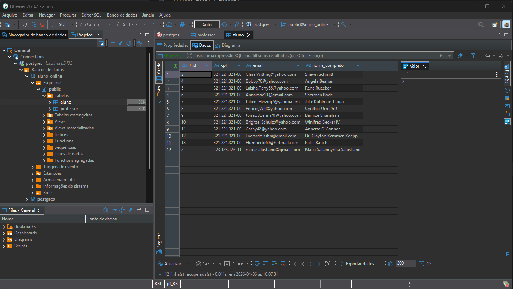
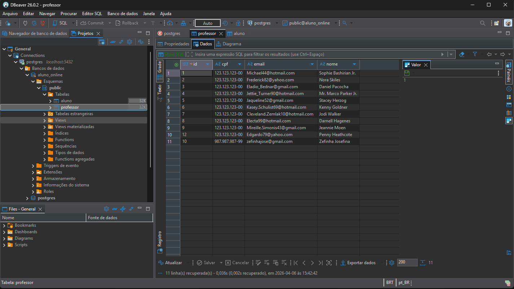
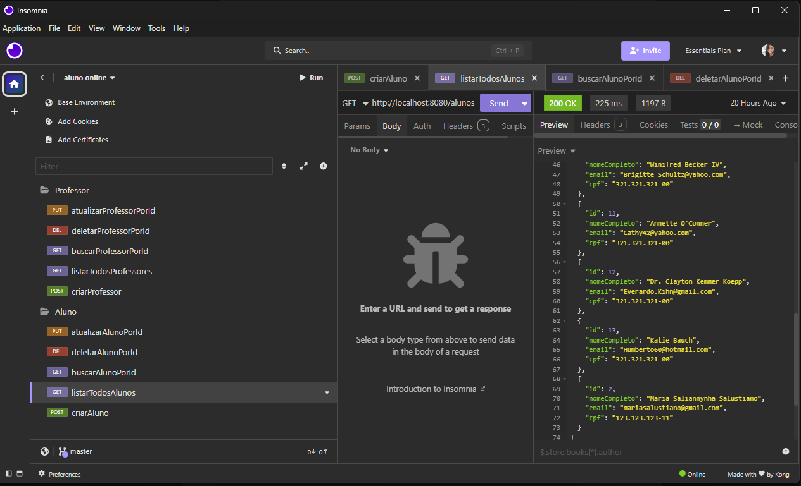
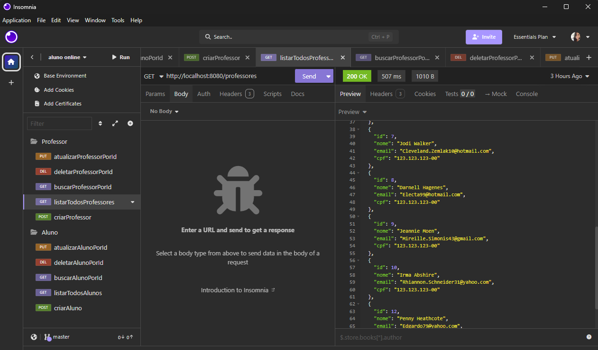

# 🎓 Projeto Aluno Online - API REST


Este projeto é uma API REST desenvolvida para a disciplina de **Tecnologia para Back-End**. O sistema consiste em um CRUD (Create, Read, Update, Delete) completo para o gerenciamento de alunos e professores, focado em organização e persistência de dados.


> Status: Em desenvolvimento ⚠️

---

## 🛠️ Funcionalidades

### Gestão de Professores
- Cadastro de docentes (Nome, Email, CPF).
- Listagem de todos os professores cadastrados.
- Busca detalhada por ID.
- Atualização de dados e remoção.

### Gestão de Alunos
- Cadastro de alunos (Nome Completo, Email, CPF).
- Listagem completa de discentes.
- Busca por ID.
- Atualização e exclusão de registros.

---

## 💻 Tecnologias Utilizadas

A estrutura deste projeto foi planejada para oferecer uma base sólida, escalável e de fácil manutenção. Utilizou-se o ecossistema Spring Boot para gerenciar a complexidade do Back-End, garantindo que as regras de negócio de Alunos e Professores sejam processadas de forma eficiente e segura.

Abaixo, estão as principais ferramentas e bibliotecas que compõem o stack tecnológico da aplicação:

| Tecnologia | Finalidade |
| :--- | :--- |
| ☕ **Java 21** | Linguagem principal com recursos modernos. |
| 🍃 **Spring Boot** | Framework base da aplicação (Use a versão mais recente). |
| 🐘 **PostgreSQL** | Banco de dados relacional. |
| 📦 **Maven** | Gestão de bibliotecas e build do projeto. |
| **Spring Web** | Criação de endpoints REST e tratamento HTTP. |
| **Spring Data JPA** | Persistência de dados e consultas SQL facilitadas. |
| **Lombok** | Redução de código boilerplate (Getters/Setters). |

---

## 🗄️ Estrutura do Banco de Dados

O projeto utiliza o **PostgreSQL** para armazenar as informações. Abaixo, a visualização das tabelas `aluno` e `professor` no DBeaver:

### Tabela: Aluno

*Campos: id, nome_completo, email, cpf.*

### Tabela: Professor

*Campos: id, nome, email, cpf.*

---

## 🟣 Testes da API (Insomnia)

A seguir, estão os resultados dos testes realizados nos endpoints da aplicação:

### Listagem de Alunos


### Listagem de Professores


---

## ⚙️ Como Executar o Projeto

1. **Clone o repositório (via terminal):**
   ```bash
   git clone https://github.com/flaviarhuana/Projeto-Aluno-Online.git

2. **Configuração do Banco de Dados:**

    No arquivo <kbd>src/main/resources/application.properties</kbd>, ajuste as credenciais de acordo com seu ambiente local:


   **Properties**
    ```properties
    spring.datasource.url=jdbc:postgresql://localhost:5432/aluno_online
    spring.datasource.username=seu_usuario
    spring.datasource.password=sua_senha

3. **Execute a aplicação:**
    Pelo IntelliJ, execute a classe <kbd>ApiApplication.java</kbd> ou via terminal:


   **Bash**
   ```bash
    mvn spring-boot:run
