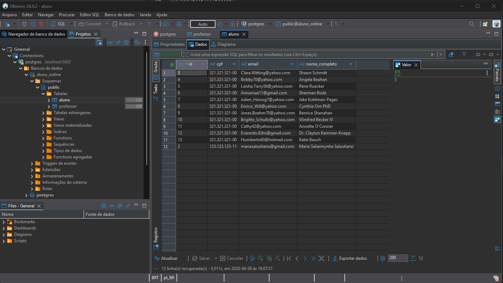
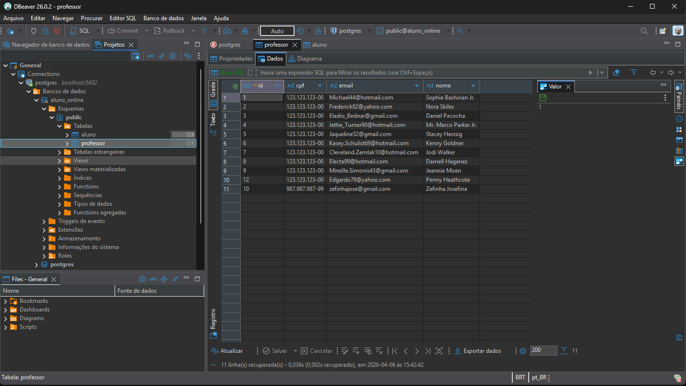
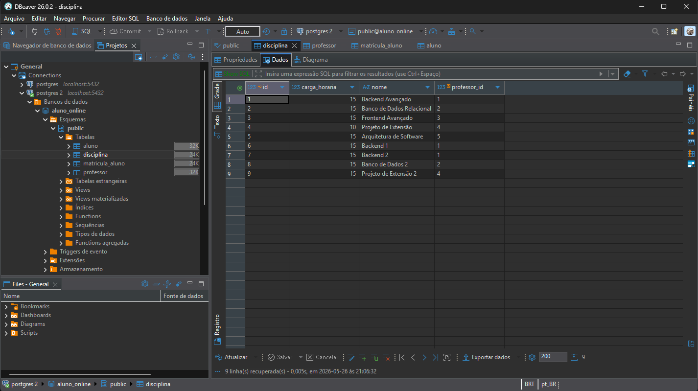
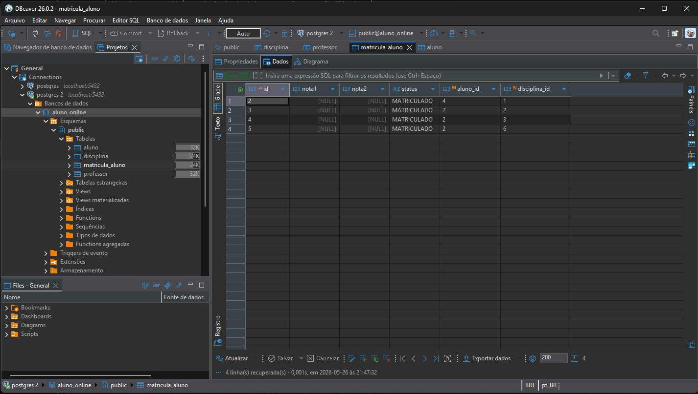
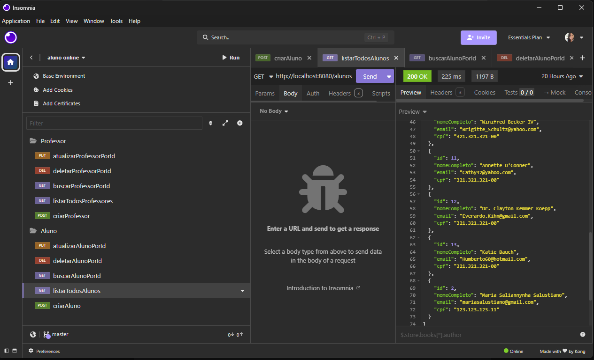
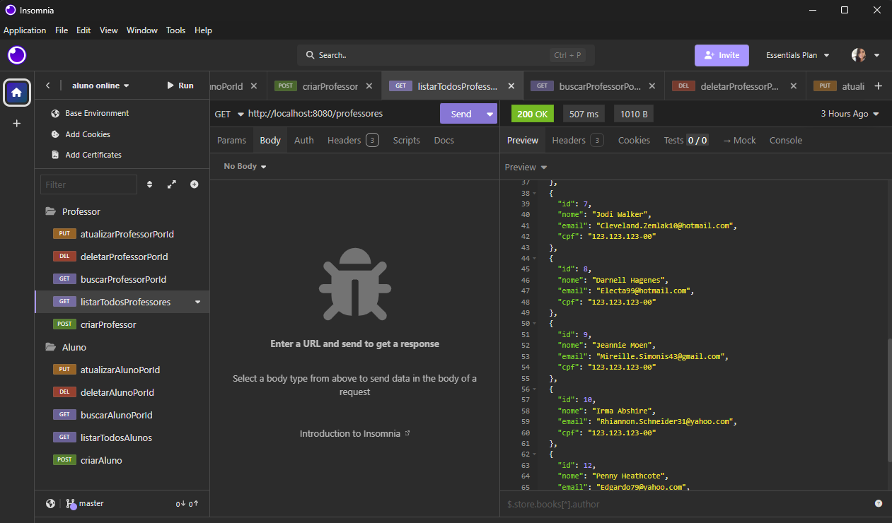
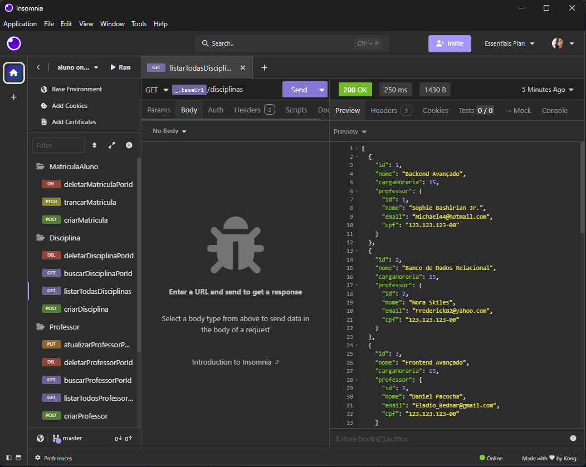
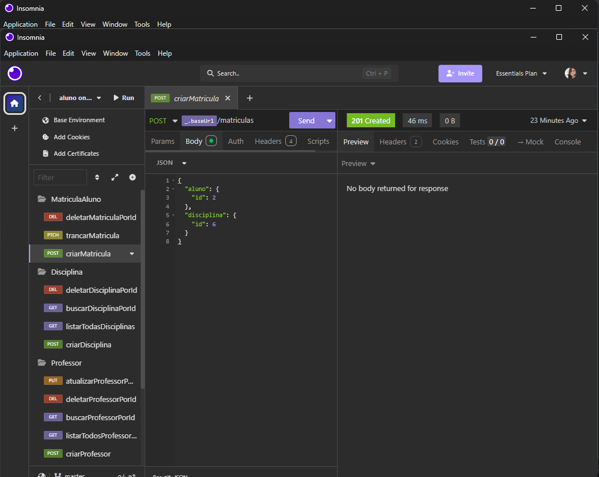

# 🎓 Projeto Aluno Online - API REST


Este projeto é uma API REST desenvolvida para a disciplina de **Tecnologia para Back-End e Banco de Dados**. O sistema consiste em um CRUD (Create, Read, Update, Delete) completo para o gerenciamento de alunos, professores, disciplinas e matrículas. O foco principal do projeto está na robustez da persistência de dados e na aplicação de inteligência nativa no banco de dados, utilizando Views para relatórios otimizados, Triggers para validações em tempo real e Stored Procedures para automação de regras de negócio complexas.


> Status: Em desenvolvimento ⚠️

---

## 🛠️ Funcionalidades

### Gestão de Professores
- Cadastro de docentes (Nome, Email, CPF).
- Listagem de todos os professores cadastrados.
- Busca detalhada por ID.
- Atualização de dados e remoção.

### Gestão de Alunos
- Cadastro de alunos (Nome Completo, Email, CPF).
- Listagem completa de discentes.
- Busca por ID.
- Atualização e exclusão de registros.

### Gestão de Disciplinas
- Cadastro de disciplinas com associação ao respectivo Docente.
- Listagem geral e busca por ID de disciplinas cadastradas.
- Atualização e exclusão de disciplinas.

### Processos Acadêmicos (Matrícula e Notas)
- **Matrícula de Alunos:** Criação de vínculo entre um Aluno e uma Disciplina com o status inicial automático de `MATRICULADO`.
- **Trancamento:** Endpoint dedicado para trancar matrículas ativas.
- **Lançamento de Notas parciais:** Suporte a atualização de notas (`nota1` e `nota2`) de forma independente (PATCH parcial).
- **Cálculo Automatizado de Status:** O sistema processa a média aritmética do aluno ao receber as duas notas e altera o status acadêmico automaticamente para `APROVADO` (caso média >= 7.0) ou `REPROVADO`.
- **Regras de Exclusão Seguras:** Implementação de rota de deleção com tratativas de integridade referencial no banco de dados.
---

## 💻 Tecnologias Utilizadas

A estrutura deste projeto foi planejada para oferecer uma base sólida, escalável e de fácil manutenção. Utilizou-se o ecossistema Spring Boot para gerenciar a complexidade do Back-End, garantindo que as regras de negócio de Alunos, Professores, Disciplinas e Matrículas sejam processadas de forma eficiente e segura.

Abaixo, estão as principais ferramentas e bibliotecas que compõem o stack tecnológico da aplicação:

| Tecnologia | Finalidade |
| :--- | :--- |
| ☕ **Java 21** | Linguagem principal com recursos modernos. |
| 🍃 **Spring Boot** | Framework base da aplicação (Use a versão mais recente). |
| 🐘 **PostgreSQL** | Banco de dados relacional. |
| 📦 **Maven** | Gestão de bibliotecas e build do projeto. |
| **Spring Web** | Criação de endpoints REST e tratamento HTTP. |
| **Spring Data JPA** | Persistência de dados e consultas SQL facilitadas. |
| **Lombok** | Redução de código boilerplate (Getters/Setters). |

---

## 🗄️ Estrutura do Banco de Dados

O projeto utiliza o **PostgreSQL** para armazenar as informações. Abaixo, a visualização das tabelas `aluno` e `professor` no DBeaver:

### Tabela: Aluno

*Campos: id, nome_completo, email, cpf.*

### Tabela: Professor

*Campos: id, nome, email, cpf.*

### Tabela: Disciplinas

*Campos: id, carga_horaria, nome, professor_id.*

### Tabela: Matrículas

*Campos: id, nota1, nota2, status, aluno_id, disciplina_id.*

---

## 🟣 Testes da API (Insomnia)

A seguir, estão os resultados dos testes realizados nos endpoints da aplicação:

### Listagem de Alunos


### Listagem de Professores


### Listagem de Disciplinas


### Criação de Matrículas


---

## ⚙️ Como Executar o Projeto

1. **Clone o repositório (via terminal):**
   ```bash
   git clone https://github.com/flaviarhuana/Projeto-Aluno-Online.git

2. **Configuração do Banco de Dados:**

    No arquivo <kbd>src/main/resources/application.properties</kbd>, ajuste as credenciais de acordo com seu ambiente local:


   **Properties**
    ```properties
    spring.datasource.url=jdbc:postgresql://localhost:5432/aluno_online
    spring.datasource.username=seu_usuario
    spring.datasource.password=sua_senha

3. **Execute a aplicação:**
    Pelo IntelliJ, execute a classe <kbd>ApiApplication.java</kbd> ou via terminal:


   **Bash**
   ```bash
    mvn spring-boot:run

## 🛠️ Configuração do Banco de Dados

Este projeto utiliza recursos nativos do PostgreSQL (Views, Triggers e Stored Procedures) para regras de negócio acadêmicas.

Os scripts para criação e atualização das estruturas estão localizados em:
`src/main/resources/db/scripts/`

- `views.sql`: Relatórios e espelhos de notas.
- `triggers.sql`: Regra de limite de matrículas e logs de auditoria.
- `procedures.sql`: Rotina automática de arredondamento de médias.

**Nota:** Execute os scripts no seu cliente SQL (ex: DBeaver) antes de rodar a aplicação para o pleno funcionamento das regras de validação.
